# Customer Subscription Prediction Using Classification Models
Author: Huda Alsaud

## Business Overview & Objective

This study uses data from a Portuguese bank that conducted direct marketing campaigns to promote a long-term term deposit to its customers. The bank contacted customers directly, mainly through telephone calls made by human agents. During these campaigns, information about customers and their interactions with the bank was recorded, including customer characteristics, previous marketing contacts, and whether a customer subscribed to the term deposit.
The main business objective is to improve the efficiency of these direct marketing campaigns by predicting which customers are more likely to subscribe to a term deposit. Using information collected from previous marketing contacts and customer characteristics, the aim is to develop classification models that can distinguish between customers who are likely to subscribe and those who are not.
Comparing different classification models allows us to determine which model provides the most useful predictions for supporting the bank’s customer targeting decisions. The expected business benefit is to focus telephone calls and other resources on a higher-quality group of potential customers, thereby reducing unnecessary contacts while maintaining or improving the number of successful subscriptions.

## Data Used in This Study
The dataset used in this study is the Bank Marketing dataset from the UCI Machine Learning Repository, which contains information collected from marketing campaigns conducted by a Portuguese bank. The data represents 17 marketing campaigns conducted between May 2008 and November 2010, involving a total of 41188 customer contacts.
During these campaigns, customers were offered an attractive long-term deposit with good interest rates. For each contact, information was recorded across several areas, including customer-related features such as age, job, marital status, education, and financial information; features related to the last contact in the current campaign, such as the contact method, timing, and duration; features describing previous and current campaign interactions; and social and economic context features reflecting broader economic conditions.
The dataset therefore provides historical information that can be used to compare different classification models for predicting customer subscription and to examine which customer and campaign characteristics are most strongly associated with successful subscriptions.

## Data Exploration and Feature Understanding
The first step was to understand how the features were distributed and how they were related to the target variable. The analysis showed that the dataset is highly imbalanced, with 88.73% of customers not subscribing to the term deposit and only 11.27% subscribing.

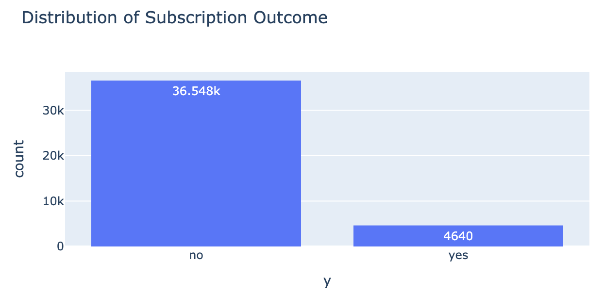 

We then compared the subscription rates across the different categorical features to identify which characteristics showed meaningful differences between customers who subscribed and those who did not. Some features showed very similar subscription rates across their categories, particularly housing, loan, and day of week, suggesting that they provided limited distinction between the two outcomes. In contrast, clearer differences were observed for job, contact type, month, and previous campaign outcome, with the previous campaign outcome showing a particularly strong difference: customers with a successful previous campaign had a 65.11% subscription rate, compared with 8.83% for customers with no previous campaign outcome. 

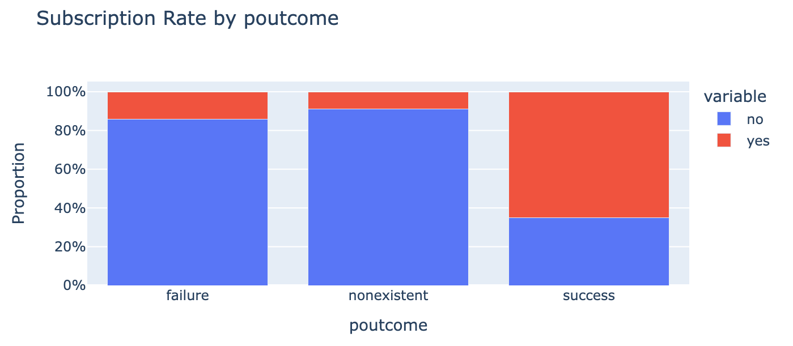
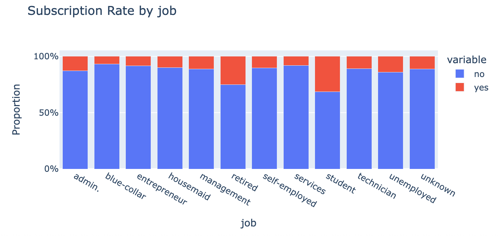
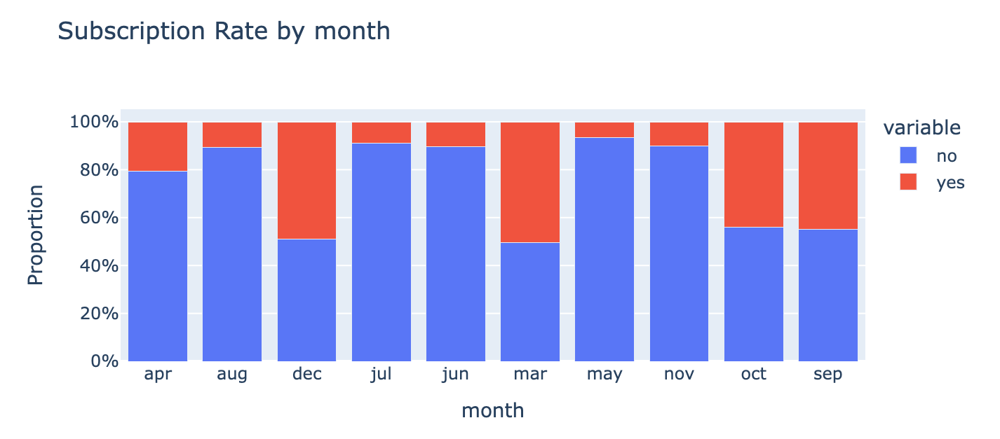

We also examined the numerical features by comparing their values for customers who subscribed and those who did not. Age showed little difference, while campaign, pdays, previous, and some economic indicators showed more noticeable differences. 

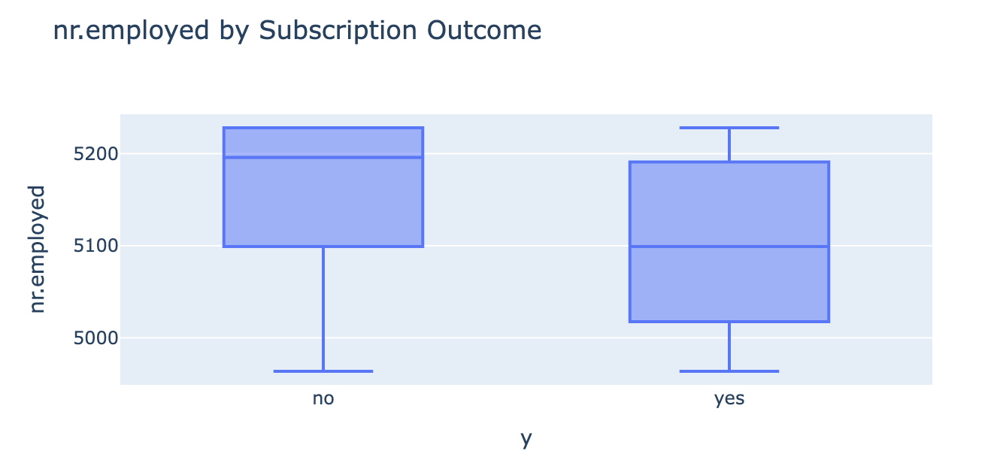
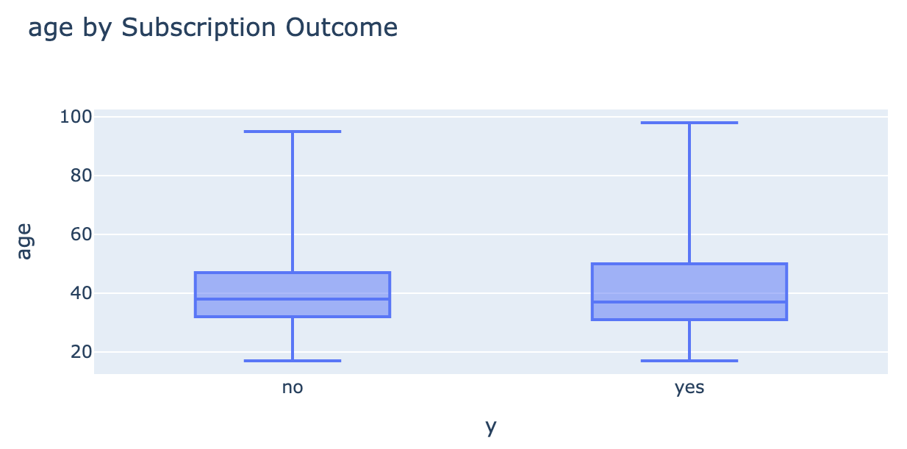

The correlation analysis then showed strong relationships among the economic features, particularly employment variation rate, euribor 3 month rate, and number of employees, meaning that these features may contain overlapping information. After investigating these relationships further, we used this information to decide which economic feature(s) should be retained rather than keeping highly similar information unnecessarily.

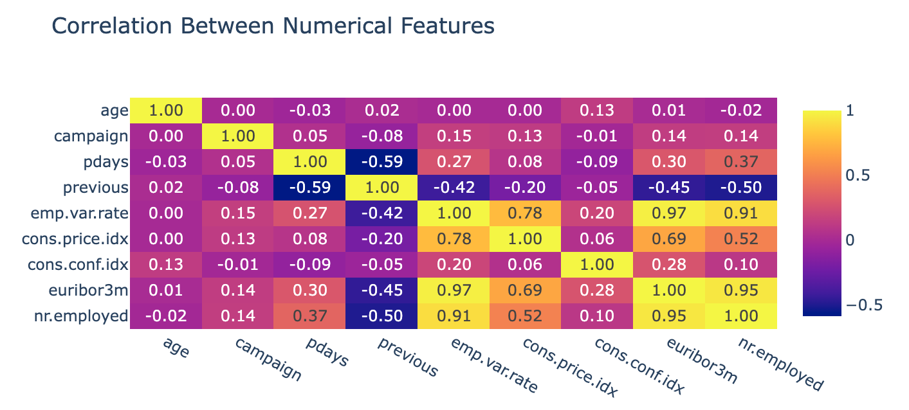

A moderate relationship was also observed between pdays and previous, while most other numerical features had relatively weak relationships. Finally, duration was excluded from the realistic prediction feature set because it is only known after the customer has already been contacted, when the outcome of that call is already known. Overall, these findings allowed us to make feature-engineering decisions based on the information contained in the data and its relationship with the subscription outcome, rather than removing or retaining features without evidence.

## Feature Engineering and Data Preparation

Based on the findings from the data exploration, we prepared the dataset for the classification models by removing features that were not considered useful for the analysis. First, duration was removed because it is only known after the customer has been contacted and the outcome of the call is already known, making it unsuitable for a realistic prediction scenario. We also removed housing, loan, and day_of_week because their categories showed very similar subscription rates and therefore provided limited distinction between customers who subscribed and those who did not. The remaining categorical features were then converted into a format suitable for the models, and the target variable was encoded.
Next, we focused on the three economic features that were found to contain highly similar information: emp.var.rate, euribor3m, and nr.employed. Rather than keeping all three, we compared their relationships with the target variable to determine which one provided the strongest association with subscription. The results showed that nr.employed had the strongest relationship with the target, with a correlation of -0.35, compared with -0.31 for euribor3m and -0.30 for emp.var.rate. 

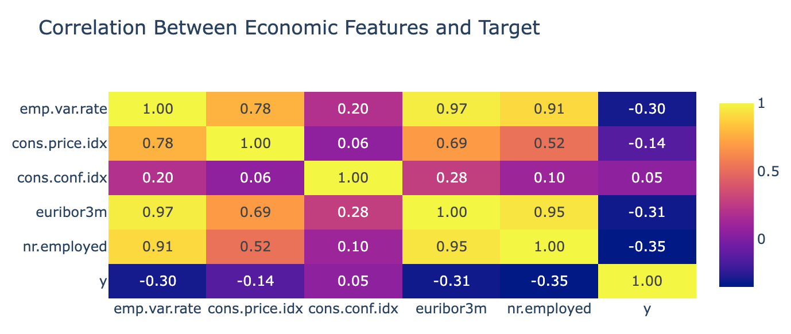

Based on this comparison, nr.employed was retained, while emp.var.rate and euribor3m were removed to reduce redundant information. Finally, the remaining numerical features were reviewed in relation to the target and scaled where required, resulting in the final feature set used for model development.

## Modeling and Choosing the Classification Model

After preparing the dataset, we built four classification models: Logistic Regression, KNN, Decision Tree, and SVM. We first trained all four models using their default settings to establish a consistent starting point and compare their initial performance. Each model was evaluated using training time, training accuracy, test accuracy, precision, recall, and F1-score.

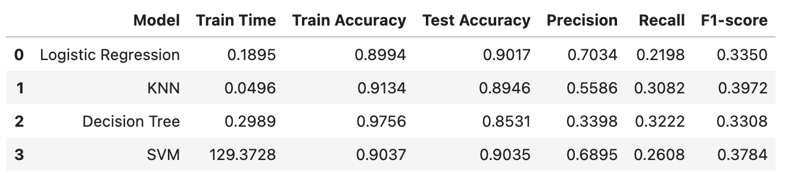
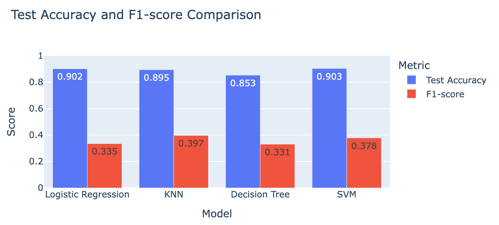

The initial results showed that while the models achieved relatively high accuracy, their ability to identify customers who actually subscribed was still limited, particularly in terms of recall. This was important because the dataset is highly imbalanced, with subscribers representing only a small portion of the customers. To improve the models, we then applied hyperparameter tuning with cross-validation to find better model settings and compared the updated results using the same performance measures. 

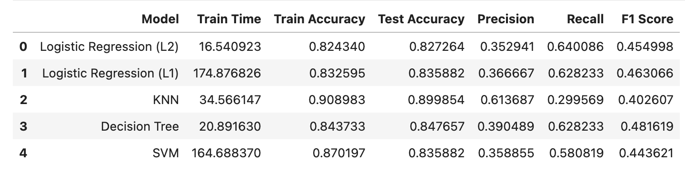
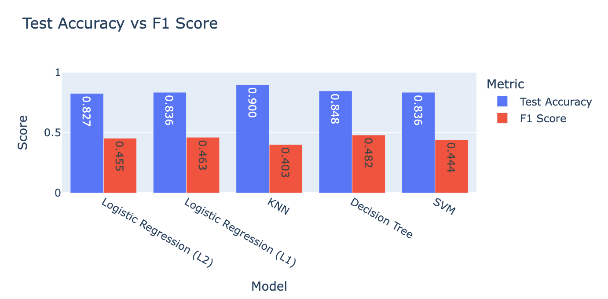

After hyperparameter tuning, the F1-scores improved from approximately 0.33–0.40 in the default models to above 0.44, with the Decision Tree reaching the highest score of 0.48.
Since the main business goal is to identify more potential subscribers rather than simply achieve high overall accuracy, we placed greater importance on the F1-score and recall when selecting the final model. After tuning, the Decision Tree achieved the highest F1-score of 0.4816 and a recall of 62.82%, meaning it was able to identify a much larger proportion of the customers who actually subscribed. Based on this performance and the project's business priority of reducing missed potential subscribers, the Decision Tree was selected as the final classification model.
The following example demonstrates how the Decision Tree model is used to predict whether a customer is likely to subscribe to a term deposit.
It shows how the model uses the customer's available information to produce a subscription prediction.

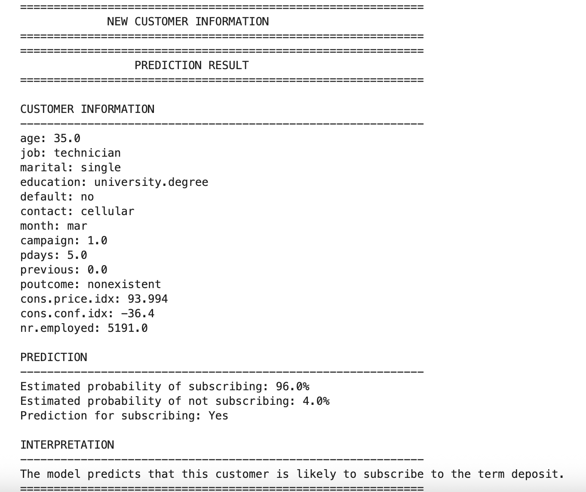

## Business Recommendation

Based on the analysis, the bank can improve the efficiency of its marketing campaigns by focusing its efforts on customers who show a higher likelihood of subscribing to a term deposit. The data analysis identified meaningful differences in subscription rates across several customer and campaign characteristics, particularly job type, contact method, campaign month, and previous campaign outcome, with customers who had a successful previous campaign outcome showing a particularly high subscription rate. These findings can help the bank better understand which customer groups are more likely to respond positively to its marketing efforts.
From a predictive perspective, the Decision Tree was selected as the preferred model because it achieved the highest score. This means the model can identify a larger proportion of customers who are likely to subscribe, which aligns with the business objective of reducing missed opportunities. The bank can therefore use the Decision Tree to score new customers based on their available information and prioritize those with a higher predicted likelihood of subscription for future marketing campaigns. This approach can help the bank use its calling resources more efficiently, reduce unnecessary contacts, and improve the potential number of successful term-deposit subscriptions.

